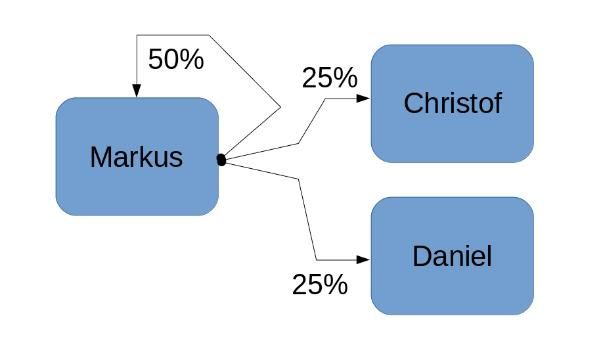

```{r setup, include=FALSE}
knitr::opts_chunk$set(echo = TRUE)
```

## Einleitung

Vom 06. - 09. Juni 2017 machten sich vier junge Männer (hier einfachhalber als Sven, Markus, Christof und Daniel bezeichnet) auf den steinigen und teilweise steilen Weg in die Alpen rund um das Karwendelgebirge. Obwohl alle vier Teilnehmer die elektronische und bargeldlose Zahlweise sehr schätzen, waren die Möglichkeiten der Nutzung auf den teilweise sehr abgelegenen Hütten eingeschränkt und die Zahlvorgänge mussten mittels Bargeld erfolgen. Die vier Freunde kamen überein, dass eine Abrechnung und der Ausgleich von zu viel oder zu wenig gezahlten Beträgen im Nachgang der gemeinsamen Reise zweckmäßig sei. Begünstigend und vertrauensbildend kam hinzu, dass einer der vier Teilnehmer bereits umfangreiche Erfahrung mit der mathematisch korrekten Ermittlung von Ausgleichszahlungen vorweisen konnte, sodass finanzielle Streitigkeiten nach Ende der Reise nahezu ausgeschlossen werden konnten.

Die nachfolgenden Erläuterungen führen kurz in die Systematik des Zahlungsstomausgleich ein, sollen jedoch keinen allumfassenden Überblick über die vielfältige wissenschaftliche Literatur zu diesem Thema ersetzen. Dem interessierten Leser sei ein Studium der in den Quellenangaben verlinkten Ressourcen empfohlen.

## Grundlagen Zahlungsströme bei Gruppenreisen

Bezahlt ein Teilnehmer der Gruppenreise für andere Teilnehmer mit, so entsteht eine Forderung zum Ausgleich der Zahlungsströme. Typischerweise zahlt jeder Teilnehmer im Laufe der Gruppenreise den einen oder anderen Betrag für die anderen Teilnehmer mit, sodass sich die Forderungen zum Teil ausgleichen. Um der deutschen Mentalität zu entsprechen und am Ende der Reise auch alle Forderungen exakt auszugleichen, ist jedoch ein standardisiertes und wissenschaftlich fundiertes Verfahren notwendig, das transparent alle geleisteten Zahlungen miteinander verrechnet und Fehlbeträge zielsicher identifiziert. 

Jeder Zahlungsstrom $\theta$, der vom Teilnehmer $\tau$ geleistet wird, teilt sich in bis zu *n* Empfänger auf, je nachdem für wie viele Teilnehmer bezahlt wird. Von zentraler Bedeutung ist dabei jedoch der Anteil $\alpha_\tau$ des Zahlungsstroms $\theta$, mit dem angegeben wird zu welchem Anteil jeder Teilnehmer durch die Zahlung abgedeckt wird. Über diese allgemeingültige Definition des Anteils $\alpha_\tau$ lassen sich viele praktisch relevante Geschäftsvorfälle modellieren, die ansonsten nur schwer abbildbar sind. Beispielsweise kann so modelliert werden, wenn ein Teilnehmer eine Zahlung ausschließlich für andere Teilnehmer leistet. Der Anteil für den Teilnehmer selbst ist in diesem Fall gleich Null während sich die anderen Anteile auf die tatsächlichen Empfänger der Leistung verteilen. Ein weiterer interessanter Anwendungsfall, der mit den Zahlungsstromanteilen abgebildet werden kann ist die Bildung von Zahlungsgemeinschaften bei bestimmten Teilnehmern. Treten beispielsweise die Teilnehmer Sven und Markus als Zahlungsgemeinschaft auf, kann auf die explizite Aufstellung von Sven als Teilnehmer verzichtet werden. Leistet Markus eine Zahlung, die auf alle vier Teilnehmer zu gleichen Anteilen verrechnet werden muss, dann erhält Markus auf sich selbst einen Zahlnugsstrom von 50%, während für Christof und Daniel jeweils ein Anteil von 25% verbleibt. Abbildung 1 verdeutlicht das eben beschriebene Beispiel.



Nachdem alle geleisteten Zahlungsströme mit ihren jeweiligen Anteilen aufgenommen sind, kann über einfache Arithmetik die Summe der geleisteten und der empfangenen Zahlungen errechnet werden. Die Differenz aus geleisteten und empfangenen Zahlungsströmen ergibt den auzugleichenden Zahlebetrag $\xi_\tau$ für jeden Teilnehmer.

## Minimierung der Ausgleichszahlungsströme

Stehen die auszugleichenden Zahlbeträge $\xi_\tau$ für jeden Teilnehmer fest, dann soll die Anzahl der notwendigen Ausgleichszahlungen minimiert werden, um mögliche Fehlbuchungen und deren nachträgliche Korrektur einzudämmen. Bei kleinen Gruppen mit zwei oder drei Teilnehmern ist dieser Schritt in der Regel trivial und lässt sich meist direkt aus den Zahlbeträgen $\xi_\tau$ ableiten. Für größere Gruppen kann jedoch ein gemischt-ganzahliges Optimierungsmodell eingesetzt werden, mit dem die notwendigen Zahlungsvorgänge $z_{ij}$ zwischen den Teilnehmern *i* und *j* auf das absolute Minimum begrenzt werden. Die Binärvariable $z_{ij}$ gibt an, ob zwischen Teilnehmer *i* und *j* eine Zahlung notwendig ist (=1) oder nicht (=0). Die Höhe des Zahlungsstroms zwischen *i* und *j* ist mit $\theta_{ij}$ gekennzeichnet. Das Optimierungsmodell lautet wie folgt:
$$
    \sum_{i,j}z_{ij} \rightarrow min
$$
$$
    \sum_i\theta_{ij} - \sum_j\theta_{ij} = \xi_i
$$
$$
    \theta_{ij} - M \cdot z_{ij} \leq 0
$$
$$
    z_{ij} \in \{0,1\}
$$
$$
    \theta_{ij} \geq 0
$$

Die Zielfunktion minimiert die Anzahl der Zahlungsvorgänge. Mit der ersten Nebenbedingung wird sichergestellt, dass die Summe der ei- und ausgehenden Zahlungsströme exakt den Zahlbetrag des Teilnehmers *i* trifft. Die zweite Nebenbedingung koppelt die Zahlvorgangvariable $z_{ij}$ an die Zahlungsströme $\theta_{ij}$, sodass der Zahlungsstrom nur größer als Null werden kann, wenn gleichzeitig die Binärvariable des Zahlungsvorgangs auf 1 gesetzt wird. Die Variable *M* ist dabei ein hinreichend großer Wert, zum Beispiel 1.000.000.000 und sollte die Summe aller Zahlungsströme übersteigen. In praktischen Anwendungsfällen exisiteren üblicherweise mehrere mögliche Zahlungsvarianten bei gleicher minimaler Anzahl Zahlvorgängen. Das Optimierungsmodell findet genau eine optimale Lösung.

## Berechnungsbeispiel zur Illustration des Verfahrens

Das in den beiden vorangehenden Kapiteln hergeleitete Verfahren zur Verrechnung der geleisteten Zahlungen wird an nachfolgendem akademischen Beispiel illustriert:

```{r echo=FALSE}
title <- c("DB Tickets Mittenwald-Seefeld", "Bergbahn Seefeld", "Hans im Glück München", "Südtiroler Stuben", "Unterkunft Garmisch",
           "Karwendelseilbahn und Getränke", "Rosshütte", "Café Seefeld", "Fahrkarte Fernverkehr Rückfahrt", "Hotel Seefeld",
           "Busfahrkarte Garmisch-Krün", "Frühstück und Kurtaxe Seefeld")
betrag <- c("24.50 €", "100.00 €", "61,50 €", "97,40 €", "118,00 €", "95,00 €", "50,00 €", "15,00 €", "116,70 €", "165,90 €",
            "19,50 €", "42,00 €")
teilnehmer <- c("Markus", "Markus", "Markus", "Markus", "Markus", "Christof", "Christof", "Christof", "Daniel", "Daniel", "Daniel", 
                "Daniel")

markus <- c("50%", "50%", "50%", "50%", "50%", "50%", "50%", "50%", "67%", "50%", "50%", "50%")
christof <- c("25%", "25%", "25%", "25%", "25%", "25%", "25%", "25%", "33%", "25%", "25%", "25%")
daniel <- c("25%", "25%", "25%", "25%", "25%", "25%", "25%", "25%", "00%", "25%", "25%", "25%")

data <- data.frame(Zahlung = title, Betrag = betrag, Teilnehmer = teilnehmer)
alpha <- data.frame(Zahlung = title, Markus = markus, Christof = christof, Daniel = daniel)
xi <- data.frame(Summen = c("Geleistete Zahlungen", "Empfangene Zahlungen", paste0("Auszugleichender Zahlbetrag")),
                 Markus = c("401,40 €", "472,20 €", "70,80 €"), Christof = c("160,00 €", "236,10 €", "76,10 €"), 
                 Daniel = c("344,10 €", "197,20 €", "-146,90 €"))
```

```{r results = 'asis', echo = FALSE}
knitr::kable(data, caption = "Tabelle 1: Zahlungen der Teilnehmer")
knitr::kable(alpha, caption = "Tabelle 2: Anteile der Zahlungen verteilt auf die Teilnehmer")
knitr::kable(xi, caption = "Tabelle 3: Ergebnisse der auszugleichenden Zahlbeträge")
```

Die Minimierung der auszugleichenden Zahlungsströme gelingt in diesem Beispiel durch scharfes Hinsehen: Die Teilnehmer Markus (als Zahlungsgemeinschaft mit dem Teilnehmer Sven) und Christof zahlen den jeweiligen Fehlbetrag an den Teilnehmer Daniel. Mit weniger als zwei Zahlungsvorgängen lässt sich der Ausgleich nicht bewerkstelligen.

## Zusammenfassung und Ausblick

In der vorliegenden Abhandlung wurde hergeleitet und erläutert wie Ausgleichszahlungen bei Gruppenreisen mit mehreren Teilnehmern verrechnet werden können, wenn Zahlungen von Teilnehmern für andere Teilnehmer getätigt wurden. Das vorgestellte Verfahren genügt den Ansprüchen der Transparenz für alle Teilnehmer und bietet durch die Modellierung der Auteilung von Zahlungsströmen in Anteile die notwendige Flexibilität zur Abbildung einer Vielzahl praktisch auftretender Konstellationen bei Gruppenreisen, wie beispielsweise Zahlungsgemeinschaften oder reine Zahlungen für andere Teilnehmer. 

Das Optimierungsmodell zur Minimierung der Zahlungsvorgänge für die Ausgleichszahlungen kann darüberhinaus für größere Gruppen zum Einsatz kommen, bei denen eine direkte Ableitung der Zahlungsvorgänge aus den Zahlbeträgen nicht mehr möglich ist. Dies trägt einerseits zur Vermeidung von Bürokratieaufwand bei, andererseits wird die Umweltbelastung durch zu viele und ggf. auftretende Fehlbuchungen / Korrekturbuchungen drastisch reduziert werden. Somit erschließt  dieser Beitrag auch Potential zur Erreichung der global vereinbarten Klimaziele zur Reduktion des $CO_2$-Ausstoßs. 

### Quellen 

- [Methodik: R Markdown](http://rmarkdown.rstudio.com/)
- [Methodik: knitR](https://yihui.name/knitr/)
- [Glossar Zahlungsverkehr](https://www.bundesbank.de/Redaktion/DE/Glossareintraege/Z/zahlungsverkehr.html)
- [Domschke, Drexl: Grundlagen Operations Research](http://www.springer.com/de/book/9783662482155)
- [Gemischt-ganzzahlige Optimierung](http://dsor-lectures.upb.de/index.php?id=41)
- [Glossar Grundbegriffe BWL](https://www.bti-online.com/bwl-glossar/)